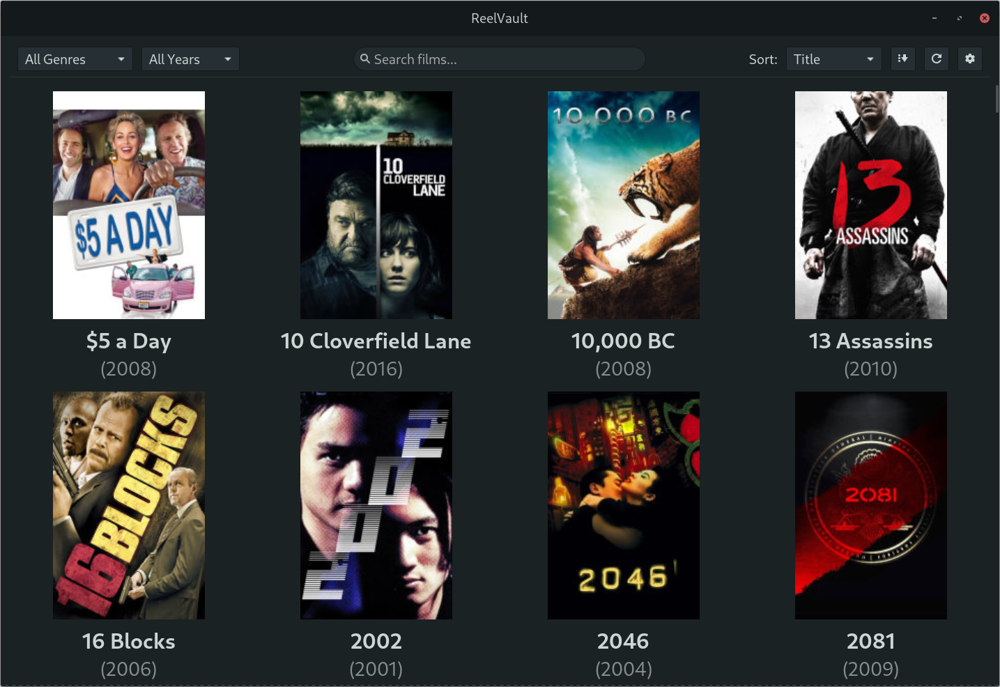

# ReelVault

A native GTK3 application for browsing and launching your local film collection.


## Features

- **Poster Grid:** Browse your film collection with cover art scraped from TMDB
- **Metadata:** View cast, crew, ratings, plot summaries, and more
- **Filtering:** Filter by genre, year, actor, director
- **Sorting:** Sort by title, year, rating, date added
- **External Player:** Launch films in your preferred video player
- **Manual Matching:** Fix incorrect matches or identify unrecognized films

## Dependencies

- GTK 3.0
- SQLite 3
- libcurl
- json-c

### Arch Linux
```bash
sudo pacman -S gtk3 sqlite curl json-c
```

### Debian/Ubuntu
```bash
sudo apt install libgtk-3-dev libsqlite3-dev libcurl4-openssl-dev libjson-c-dev
```

## Building

```bash
make
```

## Running

```bash
./reelvault
```

On first run, you'll be prompted to:
1. Enter your TMDB API key (get one free at https://www.themoviedb.org/settings/api)
2. Add your film library directories

## Configuration

Config file: `~/.config/reelvault/config.ini`

```ini
[tmdb]
api_key=your_api_key_here

[player]
command=mpv

[library]
paths=/home/user/Movies;/media/external/Films
```

## License

MIT

## Other Useful Projects

- A lightweight speech to text implementation [Auriscribe](https://github.com/rabfulton/Auriscribe)
- A full featured AI application [ChatGTK](https://github.com/rabfulton/ChatGTK)
- A Markdown notes application for your system tray [TrayMD](https://github.com/rabfulton/TrayMD)
- Try my AI panel plugin for XFCE [XFCE Ask](https://github.com/rabfulton/xfce-ask)